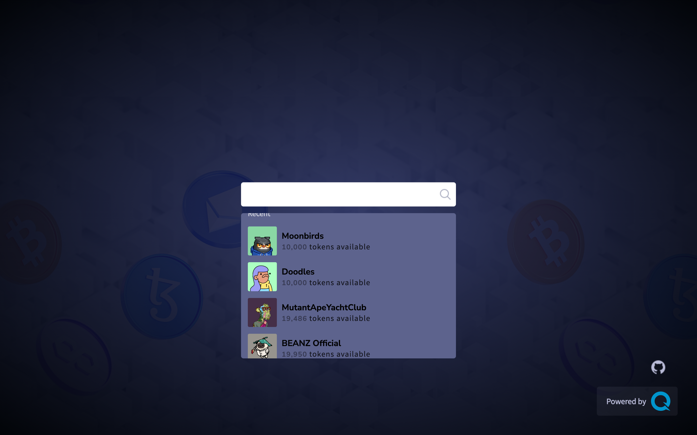
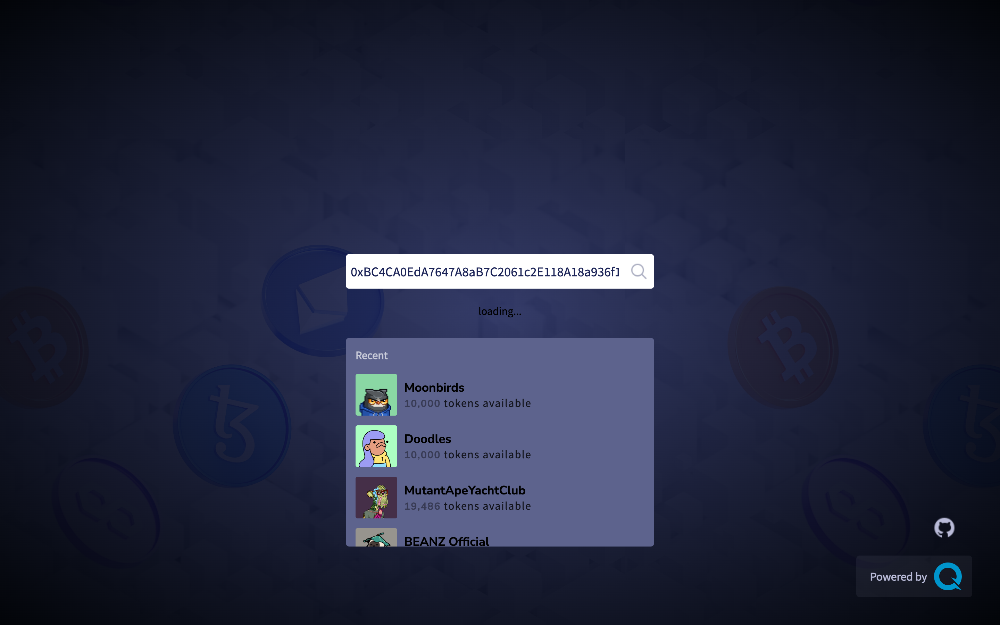
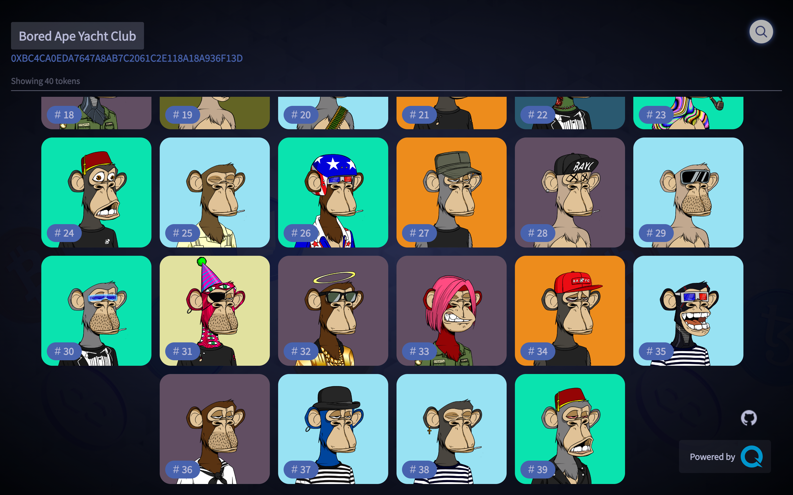

# Quicknode NFT Gallery

### Table of Contents

- [Getting Started](#getting-started)
- [Inside the DApp](#inside-the-dapp)
- [Learn More](#learn-more)

## Getting Started

First, run the development server:

```bash
npm run dev
# or
yarn dev
# or
pnpm dev
# or
bun dev
```

Open [http://localhost:3000](http://localhost:3000) with your browser to see the result.

You can start editing the page by modifying `app/page.tsx`. The page auto-updates as you edit the file.

This project uses [`next/font`](https://nextjs.org/docs/basic-features/font-optimization) to automatically optimize and load Inter, a custom Google Font.

## Inside the DApp

<div align="center">
    
    
    
</div>

## Learn More

To learn more about Quicknode, take a look at the following resources:

- [QuickNode](https://quicknode.com)
- [QuickNode NFT API](https://www.quicknode.com/docs/ethereum/qn_fetchNFTCollectionDetails_v2)
